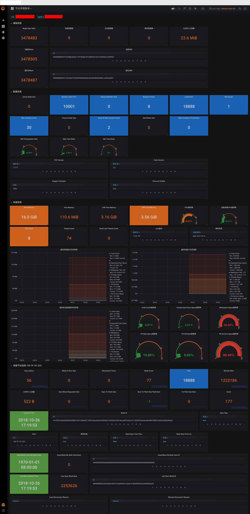

# Monitor

## A Monitor for java-tron

Monitor is a open source monitor for java-tron. It's useful for monitoring nodes
 of java-tron.

## Features

- Monitor NowBlockNum, gRPC's ping, LastSolidityBlockNum.
- Monitor Node's Basic Information, Important Configuration, MachineInformation, etc.

## Getting Started

```shell
docker pull sasaxie/tron-monitor:1.0

docker run -d \
  --name docker-influxdb-grafana-monitor \
  -p 3003:3003 \
  -p 3004:8083 \
  -p 8086:8086 \
  -p 22022:22 \
  -p 8080:8080 \
  -v $PWD/influxdb:/var/lib/influxdb \
  -v $PWD/grafana:/var/lib/grafana \
  -v $PWD/monitor:/root/go/bin/conf \
  sasaxie/tron-monitor:1.0
```

## Grafana

Open <http://localhost:3003>

```
Username: root
Password: root
```

Modify /etc/grafana/grafana.ini root_url=http://[your ip]:3003

## InfluxDB

### Web Interface

Open <http://localhost:3004>

```
Username: root
Password: root
Port: 8086
```

## Show

