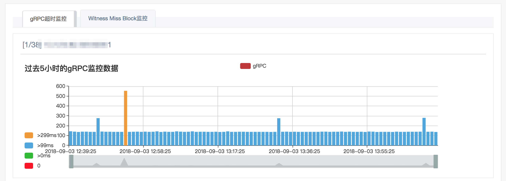
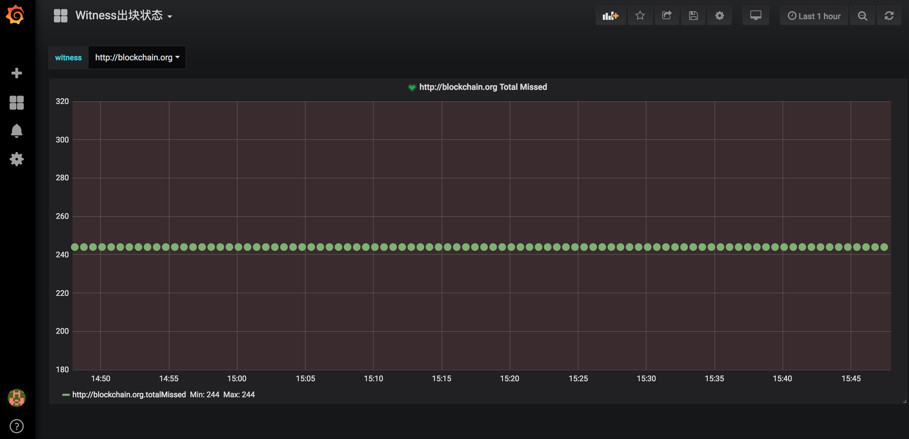

# Monitor

## A Monitor for java-tron

Monitor is a open source monitor for java-tron. It's useful for monitoring nodes
 of java-tron.

## Features

- Monitor NowBlockNum, gRPC's ping, LastSolidityBlockNum.

## Getting Started

### Install InfluxDB

1. Install InfluxDB

```shell
docker pull influxdb
```

2. Modify influxdb.conf

```shell
cd influxdb/
docker run --rm influxdb influxd config > influxdb.conf
sed "s/auth-enabled = false/auth-enabled = true/g" influxdb.conf > tmp
cat tmp > influxdb.conf
```

3. Run InfluxDB

```shell
docker run -p 8086:8086 -e INFLUXDB_ADMIN_USER=tron -e INFLUXDB_ADMIN_PASSWORD=trondb --name influxdb_monitor -v $PWD/influxdb.conf:/etc/influxdb/influxdb.conf influxdb -config /etc/influxdb/influxdb.conf
```

4. Create database

```shell
curl -XPOST http://localhost:8086/query\?u=tron\&p=trondb --data-urlencode "q=CREATE DATABASE tronmonitor"
```

5. Tips

You can stop influxdb by command `docker stop influxdb_monitor`.
You can start influxdb by command `docker start influxdb_monitor`.

### Install Monitor

1. Install Monitor

```shell
cd monitor/
docker pull sasaxie/tron-monitor
```

2. Modify monitor.toml

```shell
docker run sasaxie/tron-monitor cat /go/src/github.com/sasaxie/monitor/conf/monitor.toml > monitor.toml
```

3. Modify nodes.json

```shell
docker run sasaxie/tron-monitor cat /go/src/github.com/sasaxie/monitor/conf/nodes.json > nodes.json
```

4. Run Monitor

```shell
docker run --link influxdb_monitor --name tron-monitor -v $PWD/monitor.toml:/go/src/github.com/sasaxie/monitor/conf/monitor.toml -v $PWD/nodes.json:/go/src/github.com/sasaxie/monitor/conf/nodes.json sasaxie/tron-monitor
```

5. Tips

You can stop monitor by command `docker stop tron-monitor`.
You can start monitor by command `docker start tron-monitor`.

### Install Grafana

1. Install Grafana

```shell
docker run -p 3000:3000 --name grafana_monitor grafana/grafana
```

2. Tips

Default username: admin
Default password: admin
You can stop grafana by command `docker stop grafana_monitor`.
You can start grafana by command `docker start grafana_monitor`.

Logs

```shell
docker logs -f influxdb_monitor
docker logs -f tron-monitor
docker logs -f grafana_monitor
```

## Show



